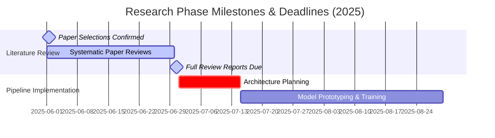

# 🧬 Genome-Sequencing

> **AI-Driven Genomic Research Laboratory**
> An advanced research repository covering whole genome sequencing, variant prioritization, and memory-efficient de novo genome assembly. Integrating cutting-edge machine learning and deep learning methodologies with modern bioinformatics workflows.

---

## 🌌 Project Pillars

<table align="center" style="width: 100%; border-collapse: collapse;">
  <tr style="background: linear-gradient(135deg, #1e1e38 0%, #2d2d54 100%); color: #ffffff;">
    <th style="padding: 15px; width: 33%; text-align: left; font-size: 1.1em; border: 1px solid #3d3d75;">🔬 Whole Genome Sequencing</th>
    <th style="padding: 15px; width: 33%; text-align: left; font-size: 1.1em; border: 1px solid #3d3d75;">🎯 Variant Prioritization</th>
    <th style="padding: 15px; width: 34%; text-align: left; font-size: 1.1em; border: 1px solid #3d3d75;">🧩 Memory-Efficient Assembly</th>
  </tr>
  <tr>
    <td style="padding: 15px; vertical-align: top; border: 1px solid #e1e4e8; background-color: #fafbfc;">
      Analysis of high-throughput raw sequencing data using deep convolutional networks and sequence transformers for accurate variant calling and base resolution.
    </td>
    <td style="padding: 15px; vertical-align: top; border: 1px solid #e1e4e8; background-color: #ffffff;">
      Leveraging structural biology (AlphaMissense, ESM1b) and evolutionary conservation pathways to predict variant pathogenicity and prioritize clinical mutations.
    </td>
    <td style="padding: 15px; vertical-align: top; border: 1px solid #e1e4e8; background-color: #fafbfc;">
      Developing Graph Neural Networks (GNNs) and geometric deep learning frameworks for de novo path resolution in assembly graphs with minimal memory footprints.
    </td>
  </tr>
</table>

---

## 👥 Meet The Team

Our multi-disciplinary team brings together expertise in deep learning, computational biology, and software engineering.

| Name | Role | Literature Review | GitHub Profile |
| :--- | :--- | :---: | :--- |
| **Samyak Jain** | 👑 Team & Research Lead | *Exempt* | [`@samyak-jain`](https://github.com/samyak-jain) |
| **Akshita Goel** | 🔬 Research Member | [View Folder](file:///home/sammyyakk/projects/genome-sequencing/literature-review/members/akshita-goel/) | [`AKSHITA-DEBUG`](https://github.com/AKSHITA-DEBUG) |
| **Abhiraj Arya** | 🔬 Research Member | [View Folder](file:///home/sammyyakk/projects/genome-sequencing/literature-review/members/abhiraj-arya/) | [`@abhiraj-arya`](https://github.com/abhiraj-arya2006) |
| **Hitanshi Bedi** | 🔬 Research Member | [View Folder](file:///home/sammyyakk/projects/genome-sequencing/literature-review/members/hitanshi-bedi/) | [`@hitanshi-bedi`](https://github.com/hitanshi-bedi) |
| **Dhriti Goswami** | 🔬 Research Member | [View Folder](file:///home/sammyyakk/projects/genome-sequencing/literature-review/members/dhriti-goswami/) | [`@dhriti-goswami`](https://github.com/dhriti-goswami) |
| **Arav Jain** | 🔬 Research Member | [View Folder](file:///home/sammyyakk/projects/genome-sequencing/literature-review/members/arav-jain/) | [`@arav-jain`](https://github.com/arav-jain) |
| **Kamakshi** | 🔬 Research Member | [View Folder](file:///home/sammyyakk/projects/genome-sequencing/literature-review/members/kamakshi/) | [`@kamakshi`](https://github.com/kams19-ops) |
| **Aditya Panda** | 🔬 Research Member | [View Folder](file:///home/sammyyakk/projects/genome-sequencing/literature-review/members/aditya-panda/) | [`@aditya-panda`](https://github.com/aditya-panda) |
| **Lavanya Mathur** | 🔬 Research Member | [View Folder](file:///home/sammyyakk/projects/genome-sequencing/literature-review/members/lavanya-mathur/) | [`@lavanya-mathur`](https://github.com/lavanya-mathur) |
| **Bhumika** | 🔬 Research Member | [View Folder](file:///home/sammyyakk/projects/genome-sequencing/literature-review/members/bhumikamansinghka/) | [`@bhumikamansinghka`](https://github.com/bhumikamansinghka) |
| **Chetna Negi** | 🔬 Research Member | [View Folder](file:///home/sammyyakk/projects/genome-sequencing/literature-review/members/chetna-negi/) | [`@chetna-negi`](https://github.com/chetna-negi) |
| **Avni Kanungo** | 🔬 Research Member | [View Folder](file:///home/sammyyakk/projects/genome-sequencing/literature-review/members/avnikanungo/) | [`@avnikanungo`](https://github.com/avnikanungo) |


---

## 📅 Roadmap & Critical Deadlines

To maintain momentum and ensure seamless integration of prior literature into our model architectures, the following timeline is established:



*   **📅 June 1, 2025**: **Paper Selections Locked** - All members must finalize their 5 self-selected papers in their respective review directories.
*   **📅 June 30, 2025**: **Full Reports Submitted** - Systematic review sheets (9 paper files per member) must be completed and merged into the main branch.

---

## 📂 Repository Architecture

```bash
Genome-Sequencing/
├── .gitignore                      # Genomic formats, model weights, environment filters
├── CONTRIBUTING.md                  # Development guidelines, git branching & commit formats
├── README.md                       # Repository overview & team cockpit (this file)
├── literature-review/              # Comprehensive review of AI in genomics
│   ├── README.md                   # Systematic search strategies, review methods
│   ├── TEMPLATE.md                 # Standalone Markdown sheet for paper reviews
│   ├── assigned-papers.md          # Registry of the 4 shared papers & self-selected claims
│   └── members/                    # Restructured review directories per researcher
│       ├── abhiraj-arya/           # Folder per researcher
│       │   ├── README.md           # Researcher index with links
│       │   ├── paper-1.md          # Survey of alignment algorithms (Assigned)
│       │   ├── paper-2.md          # SVs using long-reads (Assigned)
│       │   ├── paper-3.md          # De novo human genome assembly (Assigned)
│       │   ├── paper-4.md          # Haplotype variant calling (Assigned)
│       │   └── paper-[5-9].md      # 5 Self-selected papers reviews
│       ├── aditya-panda/           # Pre-filled reviews for Aditya Panda
│       ├── akshita-goel/           # Pre-filled reviews for Akshita Goel
│       ├── arav-jain/              # Pre-filled reviews for Arav Jain
│       ├── avni-kanungo/           # Reviews for Avni Kanungo (Added)
│       ├── bhumika/                # Pre-filled reviews for Bhumika
│       ├── chetna-negi/            # Reviews for Chetna Negi (Added)
│       ├── dhriti-goswami/         # Pre-filled reviews for Dhriti Goswami
│       ├── hitanshi-bedi/          # Pre-filled reviews for Hitanshi Bedi
│       ├── kamakshi/               # Pre-filled reviews for Kamakshi
│       └── lavanya-mathur/         # Pre-filled reviews for Lavanya Mathur
├── problems/                       # Target problem definitions and pipeline architecture

│   ├── problem-3-variant-prioritization/
│   │   └── README.md               # Pipeline for filtering & ranking pathogenic mutations
│   └── problem-4-genome-assembly/
│       └── README.md               # Memory-efficient de novo graph assembly strategies
├── datasets/                       # External dataset schemas & links (.gitkeep to track)
├── experiments/                    # Training logs, parameter sweeps, and evaluations
└── models/                         # Model checkpoints and network definitions
```

---

## 🛠️ Development Quickstart

1. **Clone the Repository**:
   ```bash
   git clone https://github.com/sammyyakk/genome-sequencing.git
   cd genome-sequencing
   ```
2. **Review the Contributions Guide**: Read [`CONTRIBUTING.md`](file:///home/sammyyakk/projects/genome-sequencing/CONTRIBUTING.md) to understand branching conventions (`name/task`) and commit requirements.
3. **Draft your Literature Reviews**: Navigate to your member folder in [`literature-review/members/`](file:///home/sammyyakk/projects/genome-sequencing/literature-review/members/) and fill out the pre-made review tables in `paper-1.md` through `paper-9.md`.

---

<p align="center">
  <i>Developed with 🧬 and 🧠 by the Genome Sequencing Research Team. All rights reserved.</i>
</p>
