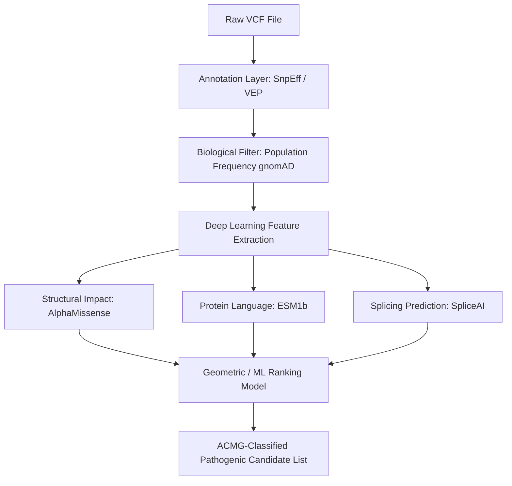

# 🎯 Problem 3: Variant Prioritization

## 📋 Problem Statement

Whole Genome Sequencing (WGS) identifies millions of genetic variants in a single individual. Identifying the single or few **pathogenic mutations** responsible for a specific rare genetic disease or clinical phenotype is like finding a needle in a haystack. 

Variant Prioritization is the systematic process of filtering, annotating, and ranking these variants based on their predicted impact on protein structure, evolutionary conservation, cellular pathways, and clinical history. The goal of this project is to develop and evaluate **AI-driven prioritization algorithms** that automate and scale clinical variant interpretation in compliance with ACMG/AMP guidelines.

---

## 🛠️ Pipeline Overview

Our prioritization workflow is structured as an end-to-end computational pipeline integrating classical genomic metrics with state-of-the-art deep learning predictions:

1.  **Variant Call Annotation**: Raw genomic variants (VCF format) are annotated with transcriptional consequences, exon locations, and amino acid changes using **VEP (Variant Effect Predictor)** or **SnpEff**.
2.  **Filtering & Frequency Analysis**: Common variants (population frequency $> 1\%$ in **gnomAD**) are filtered out as they are unlikely to cause rare monogenic disorders.
3.  **Pathogenicity Prediction**:
    *   *Missense Variants*: Pathogenicity scoring using structural predictions (**AlphaMissense**).
    *   *Sequence Embeddings*: Feature extraction from protein language models (**ESM1b**) to represent evolutionary constraints.
    *   *Splicing & Non-coding Variants*: Deep learning predictions for splicing changes (**SpliceAI**).
4.  **Prioritization & Ranking**: A supervised ranking algorithm (e.g., Extreme Gradient Boosting or Graph Neural Networks) fuses population frequency, clinical data (HPO terms), and deep learning scores to output a ranked list of candidate variants.

---

## 🔬 Core Tools & Technologies

*   **AlphaMissense**: DeepMind's state-of-the-art structural pathogenicity predictor for missense variants.
*   **ESM1b / ESM2**: Meta's deep protein language models, extracting evolutionary and functional embeddings directly from amino acid sequences.
*   **Enformer**: Calico/DeepMind's transformer-based model for predicting gene expression and chromatin states directly from sequence.
*   **VEP (Variant Effect Predictor)**: Ensembl's robust database and CLI tool for annotating variants with transcripts, clinical classifications (ClinVar), and regulatory effects.
*   **gnomAD**: Genome Aggregation Database, providing population-level allele frequencies to filter out benign variations.

---

## 🚀 Relevant Sub-Projects

### 🔹 [Sub-Project 3.1] Pathogenicity Prediction of Missense Mutations
*   *Objective*: Train a downstream ensemble classifier combining **AlphaMissense** scores, structural B-factors, and **ESM1b** embeddings to resolve "Variants of Uncertain Significance" (VUS) in rare disease patient cohorts.
*   *Key Deliverable*: Custom python modules for cross-database indexing and scoring of unknown mutations.

### 🔹 [Sub-Project 3.2] Splice-Site Disruption Prediction
*   *Objective*: Develop deep learning architectures (e.g., Dilated CNNs or Dilated Transformers) that predict non-coding variant impacts on alternative splicing.
*   *Key Deliverable*: Model weights and benchmarking outputs comparing splicing prediction accuracy against **SpliceAI**.

### 🔹 [Sub-Project 3.3] Graph Neural Networks for Single-Cell Variants
*   *Objective*: Map gene expression changes in single-cell RNA-seq (scRNA-seq) onto cell-type signaling networks using Graph Neural Networks (GNNs), predicting multi-condition genomic variations.
*   *Key Deliverable*: A PyTorch Geometric (PyG) library for constructing and predicting graph node labels in scRNA-seq networks.
