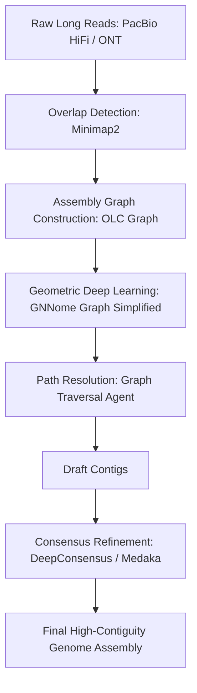

# 🧩 Problem 4: Genome Assembly

## 📋 Problem Statement

*De novo* genome assembly is the process of reconstructing a complete genome sequence from millions of short or long overlapping DNA reads, without using a reference genome. Traditional assemblers rely heavily on hand-crafted heuristics and complex algorithms to simplify assembly graphs (e.g., de Bruijn or Overlap-Layout-Consensus graphs) and resolve repetitive genomic regions, which are highly prone to misassemblies and require massive computational memory.

The goal of this project is to develop and implement **memory-efficient, AI-enhanced genome assemblers**. We focus on leveraging **Geometric Deep Learning / Graph Neural Networks (GNNs)** to learn graph-traversal rules for path resolution, and machine learning models to optimize computational resource allocation in high-performance computing (HPC) environments.

---

## 🛠️ Pipeline Overview

Our assembly architecture integrates state-of-the-art long-read alignment with modern machine learning graph simplifiers:

1.  **Overlap and Mapping**: Long, high-accuracy reads (PacBio HiFi or Oxford Nanopore) are compared using **Minimap2** to identify significant regions of sequence overlap.
2.  **Assembly Graph Construction**: An Overlap-Layout-Consensus (OLC) graph or de Bruijn Graph is constructed, where nodes represent sequences/k-mers and edges represent overlaps.
3.  **AI Path Resolution**:
    *   *Geometric DL*: Graph Neural Networks (**GNNome**) process the assembly graph, learning to predict which edges are true biological continuities rather than repetitive artifacts.
    *   *Graph Simplification*: High-noise nodes and bubbles are resolved dynamically through deep reinforcement learning or deep path-finding agents.
4.  **Consensus Correction**: Draft contigs are polished using sequence transformers (**DeepConsensus**) that correct base errors directly from raw sequencing signals and read alignments.

---

## 🔬 Core Tools & Technologies

*   **GNNome**: A pioneering geometric deep learning framework utilizing Graph Neural Networks (GNNs) to simplify and resolve paths in de novo assembly graphs.
*   **Flye & Hifiasm**: State-of-the-art traditional de novo assemblers for single-molecule long reads, serving as our primary evaluation baselines.
*   **DeepConsensus**: A gap-aware sequence transformer model that corrects errors in long reads by analyzing base alignment profiles.
*   **Minimap2**: A highly optimized, standard alignment and mapping engine for genomic sequences.
*   **Quast**: Genome assembly evaluation tool used to compare contiguity (N50, L50) and error rates against reference benchmarks.

---

## 🚀 Relevant Sub-Projects

### 🔹 [Sub-Project 4.1] Geometric Deep Learning for Assembly Graph Resolution
*   *Objective*: Implement and train Graph Neural Networks (GNNs) on simulated assembly graphs to classify valid overlap transitions, bypassing manual heuristics for bubble-popping and tip-clipping.
*   *Key Deliverable*: Custom PyTorch Geometric models trained to predict edge probabilities in complex eukaryotic assembly graphs.

### 🔹 [Sub-Project 4.2] Machine Learning-Based Memory & Resource Prediction
*   *Objective*: Build predictive ML regressors (e.g., Random Forests, Gradient Boosted Trees) that analyze read properties (file size, k-mer distributions, average coverage) to predict CPU time and peak RAM usage prior to launching assembler runs on HPC clusters.
*   *Key Deliverable*: Lightweight CLI tool and API that warns users of potential Out-of-Memory (OOM) failures and optimizes resource reservation.

### 🔹 [Sub-Project 4.3] Transformer-Based Consensus Refinement
*   *Objective*: Develop sequence-to-sequence transformers optimized for nanopore and PacBio read pileups, correcting residual insertions/deletions (indels) in draft assemblies.
*   *Key Deliverable*: Consensus refinement pipeline exhibiting superior base-accuracy metrics compared to traditional tools.
